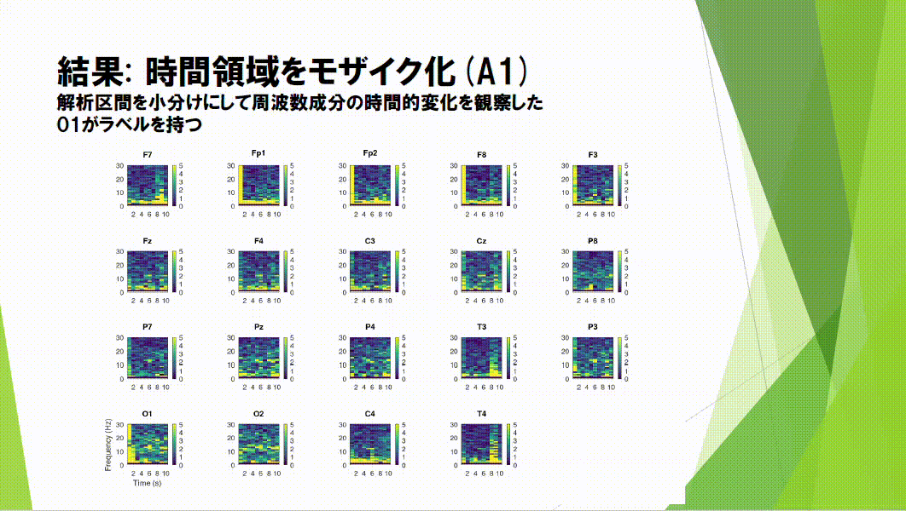

# EEG Analysis with Octave

This repository contains code and results for an EEG (electroencephalogram) analysis project conducted with GNU Octave.  
The main objective was to investigate the differences between **eyes-closed (A1)** and **eyes-open (A2)** resting states, and to validate knowledge from lectures through hands-on data analysis.

---

## Features

The analysis covers multiple stages of EEG signal processing and visualization:

- **Raw waveform plotting** for each channel
- **Frequency analysis** using Discrete Fourier Transform (DFT)
- **Topographic scalp plots** for spectral results
- **Band-specific average amplitude plots** (θ, α, β, γ bands)
- **Time-frequency analysis** (short-time frequency changes)
- **Topographical maps per frequency band** (spatial distribution of EEG activity)

---

## Results Overview

- **Alpha waves** were prominently observed in the occipital region during eyes-closed conditions.
- **Theta waves** appeared less in closed-eye data, while **beta activity** increased in eyes-open conditions.
- **Topographic asymmetry** was observed between left and right hemispheres, suggesting lateralized activity.
- Time-frequency mosaics revealed more stable low-frequency components during eyes-closed states.

---

## Requirements

- [GNU Octave](https://octave.org/) (≥ 6.0.0)
- Signal processing package for Octave (`pkg install -forge signal`)
